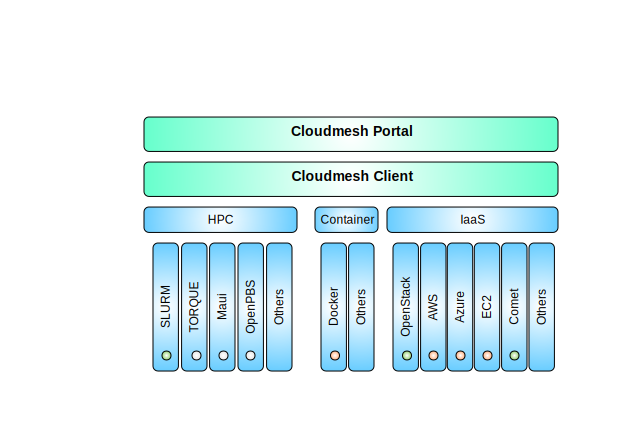
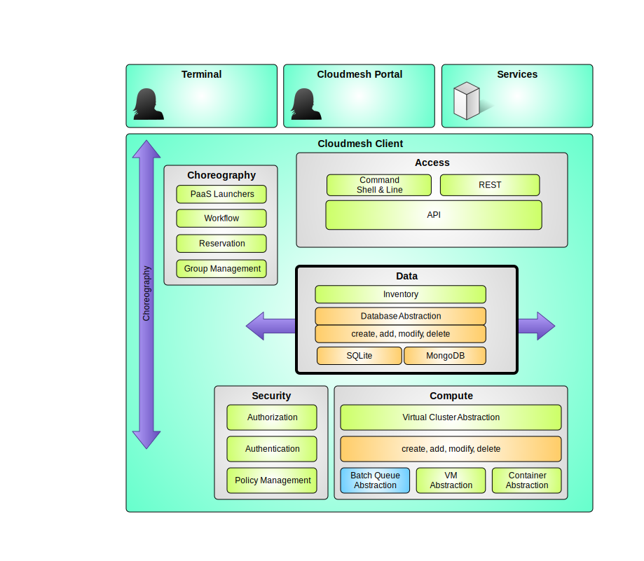

Introduction
=============

:download:`8 page slide presentation<images/cloudmesh-arch.pptx>`

Cloudmesh client allows to easily manage virtual machines, containers,
HPC tasks,  through a convenienet client and API. Hence cloudmesh is
not only a multi-cloud, but a multi-hpc environment that allows also
to use container technologies (under development).

**Client based.** The new cloudmesh is client based. That is cloudmesh
is run on the users computers. THis also includes an add on component
to the cloudmesh clienet which is a portal. Hence we destinguish the
client that containes most of the functionality, as well as a portal
that can access the functionality of the portal. Important to note is
that the user manages its own credentials as he runs the cloudmesh
client on his own machine. This increses the security as access to any
credential is managed by the user and is not part of a credential
management system.
	 
**Layered Architecture.** Cloudmesh client has a layered architecture
that allows easy development of new features. This also allows
contribution by the community while developing integrated and smaller
sub components. Figure A depicts the various layers. A resource
abstraction layer allowes the integration of a multitude of resources
spanning HPC, Containers, and Cloud resources. (At this time we focus
on Openstack and Slurm resources. We are working on reintegrating
resources such as Azure, AWS, Maui, Moab, and others which we
previously supported, as well as new resources such as docker). 

   Figure A: Cloudmesh layered architecture.

**Management Framework.** Cloudmesh clinet contains a management
framework, and its components are depicted in Figure B. cloudmesh
allows easy management of virtual machines, containers, and the data
associated with them. We are currently developping a choreography
framework that leverages Ansible, chef, and heat. All of the
functionality is easyly usable through a command shell that also can
be used from the commandline, and a Python API. IN future we will be
providing a REST API. 
   

   Figure B: Cloudmesh component overview.

**Database Agnostic.** Cloudmesh contains some state about the
resource and environment that a user may want to use. The information
is managed in an database abstraction that would allow storing the
data in a variety of databases such as SQL and MongoDB. At this time
we have chosen SQLite to be the default database as it does not
require any additional setup and is universally available on all
operating systems without change. 

**Command shell and line.** Cloudmesh contains a command shell
allowing scripts to be developed and run. However we designed the
command shell in such a way that each command can also be called from
the command line. Through the cloudmesh statemachine the state between
command shell, command client, and the portal is shared.

**Cloudmesh Clienet Portal.** Previously, we distributed cloudmesh
with client, server, and a portal components in one package. This
however turned out to be to complex to be installed for some of our
less technically skilled user community. Thus we split up the install
into two indepenendt packages. The cloudmesh client and the cloudmesh
portal. The portal provides some elementary fieatures to manage
virtual machines and HPC jobs. At this time the portal is considered
to be alpha technology. Just as the client the portal is to be run on
the local user machine in oredr to allow increased security by
managing the credentials locally ratherthan on a server.

**Cloudmesh Two Factor Authentication.** We have an exploratory
project in place that looks at the use of Yubikeys for cloudmesh,
client and cloudmesh portal. 

**Cloudmesh Comet.** We are actively developing the client interface
for SDSC's comet supercomputer allowing bare metal provisioning. The
interface reuses cloudmesh components and technologies while
interfacing with the comet cloud REST interface. The goal here is to
manage virtual clusters.

* 

Where to go next?
------------------

What to read next may depend on your interest. Certainly you want to
install cloudmesh while following the

Instalation information

Next we recommend that you get familiar with the concept of defaults
in cloudmesh. After that you have several options:

* If you are interestted in clouds such as Openstack read the `cloud Manual`

* If you are interested in Comet read the :ref:`the comet command
  manual <comet_command>``.

* If you are interested in HPC read the `HPC command manaul`

