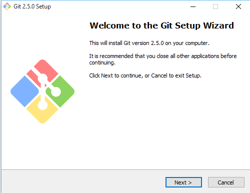
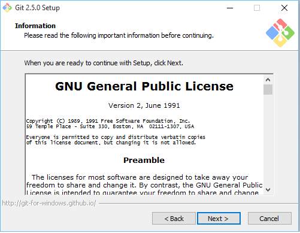
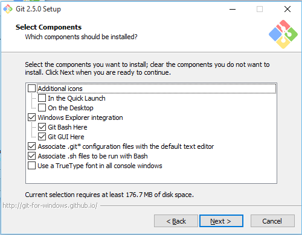
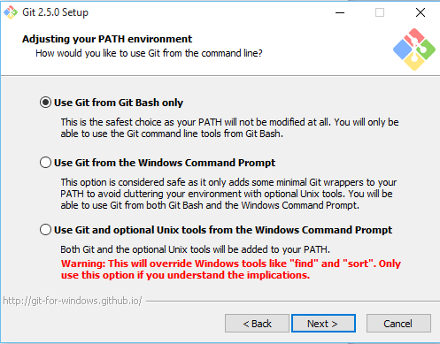
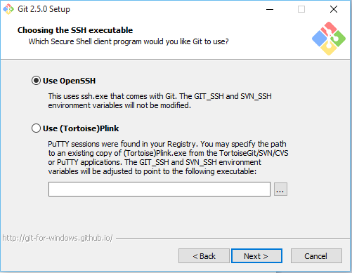
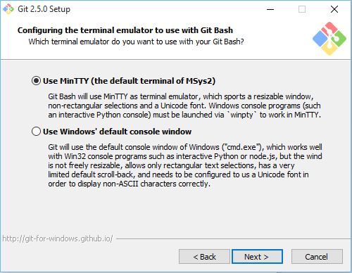
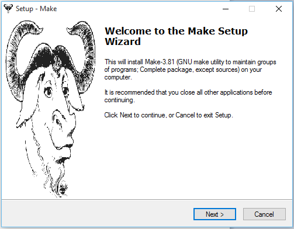

System Preparation
===================

The instalation of cloudmesh is easiest if you prepare your system with some elementary
software. We provide such information for the following Operating systems:

* Linux

  * Ubuntu
  * Centos
    
* OSX
* Windows

For each of these operating systems we are provide specific
instalation instructions.

Prepare the system
------------------

OSX
^^^

On OSX we recommend that you use python 2.7.10. This version of python
is easy to install while downloading the dmg and installing it on the
system. You will still have access to the python version distributed
with the original OSX operating system.

To test out which version you have activated, you can use in the
commandline::

  python --version
  pip --version

They should show something similar to::

  Python 2.7.10
  pip 7.0.3

Oon OSX as well as the other operating systems we **require** you to
use virtualenv. First you need to find which version of python you
use. You can say::

  which python

It will give you the path of the python interpreter. Let us assume the
interpreter was found in `/usr/local/bin/python`.  Next you can create
a virtual ENV with::

  virtualenv -p /user/local/bin/python ~/ENV

You will need to activate the virtualenv::

  source ~/ENV/bin/activate

If sucessfull, your terminal will have (ENV) as prefix to the prompt::

  (ENV)machinename:dirname user$

As OSX comes with older versions of pip at this time, it is important
that you first prepare the environment before you install cloudmesh
client. To do so please isseue the following commands::

   
   export PYTHONPATH=~/ENV/lib/python2.7/site-packages:$PYTHONPATH
   pip install pip -U
   easy_install readline
   easy_install pycrypto
   pip install urllib3

.. warning:: We found that ``readline`` and ``pycrypto`` could not be
	  installed with pip at the time of writing of this manual,
	  despite the fact that pip installed it. Howerver, the
	  version installed with pip were not usable. The workaround
	  is to use easy_install for these packages. If you have a
	  better idea how to fix this, let us know and send mail to
	  laszewski@gmail.com.

It is recommended that you test the version of the python interpreter
and pip again::
   
   pip --version

which should give the version 7.1.2
   
::

   python --version

which should give the version Python 2.7.10

.. _windows-install:

Windows 10
^^^^^^^^^^^^^^^^^^^^^^^^^^^^^^^^^^^^^^^^^^^^^^^^^^^^^^^^^^^^^^^^^^^^^^

Install Python
~~~~~~~~~~~~~~~~~~~~~~~~~~~~~~~~~~~~~~~~~~~~~~~~~~~~~~~~~~~~~~~~~~~~~~
	     
Python can be found at http://www.python.org. We recommend to download
and install the newest version of python. At this time we recommend
that you use version 2.7.10. Other versions may work to, but are not
supported or tested. A direct link to the install can be found at

* https://www.python.org/ftp/python/2.7.10/python-2.7.10.msi

In powershell you can type::

  explorer https://www.python.org/ftp/python/2.7.10/python-2.7.10.msi

Thsi will open the Windows explorer, download the msi and ask you to
install it.

Once downloaded, open it by clicking on the downloaded file. You may
also want to change the properties and add python to the path

.. warning:: At this time we have not yet finalized the instaltion
	     instructions for Windows. We have two candidates. ONe
	     developed by Erika and Gourav, which seem not yet to work
	     when it comes to ssh, sc, and ssh-keygen without using
	     gitbash. So it can not be used directly from powershell.
	     The other instructions are from gregor, which do not
	     require any GUI, but leverage the chocolatey tool which
	     is a sort of package manager from windows.

	     We will pesent the information in two different
	     subsections

Gregors Windows install Instructions
~~~~~~~~~~~~~~~~~~~~~~~~~~~~~~~~~~~~~~

Install chocolatey::

  Start-Process powershell -Verb runAs
  Set-ExecutionPolicy Unrestricted
  iex ((new-object net.webclient).DownloadString('https://chocolatey.org/install.ps1'))
  Set-ExecutionPolicy Restricted

Restart the administrative shell so you can use choco

In adminstrative new power shell Install Gnu on windows::

  choco install gow -y --force
  choco install git.commandline -y
  
Restart a new powershell window to use the commands

In non administrative shell::

  mkdir $HOME/.ssh.

Remember to always use $HOME instead of ~ as commands such as ssh, and
sshkeygen do not use ~::

  ssh-keygen -f $HOME/.ssh/id_rsa

Go to::

  https://portal.futuresystems.org

Once you log in you can use the following link::

  https://portal.futuresystems.org/my/ssh-keys

Naturally this only works if you are elidgable to register and get an
account. Once you are in a valid project you can user indias
resources. After that you need to upload your public key that you
generated into the portal.

.. warning:: Windows will not past and copy correctly, please make
	     sure that newlines are removed for the text box where you
	     past the key. This is cause for many errors. MAke sure
	     that the key in the text box is a single line and looks
	     like when you cat it

Next you can ssh into the machine like this::

   ssh -i $HOME/.ssh/id_rsa $PORTALNAME@india.futuregrid.org

where $PORTALNAME is your futuresystems portal name. Note that a login
without the -i seems not to work.

.. todo:: find a way to use $PORTALNAME and set that, as we do in rest
	  of documentation this way we can do a set of the $PORTALNAME
	  first and use this consistently throughout the documentation.
	     

Install Gnu Like tools - Erika and Gourav
~~~~~~~~~~~~~~~~~~~~~~~~~~~~~~~~~~~~~~~~~~~~~~~~~~~~~~~~~~~~~~~~~~~~~~

Install Git in Windows
""""""""""""""""""""""""""""""""""""""""""""""""""""""""""""""""""""""

To download and install git for windows, please go to

* https://git-scm.com/download/win

You will be asked a couple of questions and you should make sure that
you install it so that git can be run from the terminal.

Read and Accept the License to proceed.

Select which components need to be installed. Keep the default options.

We prefer to use GitBash as our command line tool for Git

Select OpenSSH as the secure shell client program.

Keep the default option selected - MinTTY terminal

Then select the default options to proceed; Git will be installed on your machine.

To check if Git is installed on your machine, open GitBash from Start menu
and type the following::

  git --version

This should return git version 2.5.0.windows.1

Install make In Windows
""""""""""""""""""""""""""""""""""""""""""""""""""""""""""""""""""""""

To download and install "make" for windows, please go to:

* http://gnuwin32.sourceforge.net/downlinks/make.php

This will download the installer for make on your machine. Follow the
on-screen instructions and make will be installed.

Read and Accept the License to proceed.

.. image:: images/make_setup/make_setup_license.png

Select which components need to be installed. Keep the default options.

.. image:: images/make_setup/make_setup_components.png

Select path where make is to be installed on your machine.

.. image:: images/make_setup/make_setup_dest.png

Then select the default options to proceed; Make will be installed on your machine.

Next, you need to add the location of "make.exe" to your system PATH environment variable.

Make.exe will most likely be installed at::

  C:\Program Files (x86)\GnuWin32\bin\make.exe

Add this location to the PATH variable::

  PATH = %PATH%;C:\Program Files (x86)\GnuWin32\bin;

Makeing python usable
~~~~~~~~~~~~~~~~~~~~~~~~~~~~~~~~~~~~~~~~~~~~~~~~~~~~~~~~~~~~~~~~~~~~~~

To test if you have the right version of python execute::

  python --version

which should return 2.7.10 and::

  pip --version

You might see version 7.0.1 in which case you should update with::

  pip install -U pip 

.. note:: the update may not work as some error is reported. This
	  needs to be investigated and a workaround needs to be found.

We want also to install virtualenv::

  pip install virtualenv

and pyreadline::

   pip install pyreadline

Linux
^^^^^^^^^^^^^^^^^^^^^^^^^^^^^^^^^^^^^^^^^^^^^^^^^^^^^^^^^^^^^^^^^^^^^^

use fresh machine (VM).
use standard python
use ubuntu ???

wahtch out for
urllib 3
readline
pip update
aptget update
aptget upgrade
....

CentOS
~~~~~~~~~~~~~~~~~~~~~~~~~~~~~~~~~~~~~~~~~~~~~~~~~~~~~~~~~~~~~~~~~~~~~~

.. todo:: Mangirish provide instructions

Ubuntu
~~~~~~~~~~~~~~~~~~~~~~~~~~~~~~~~~~~~~~~~~~~~~~~~~~~~~~~~~~~~~~~~~~~~~~

.. todo:: Gurav provide instructions

