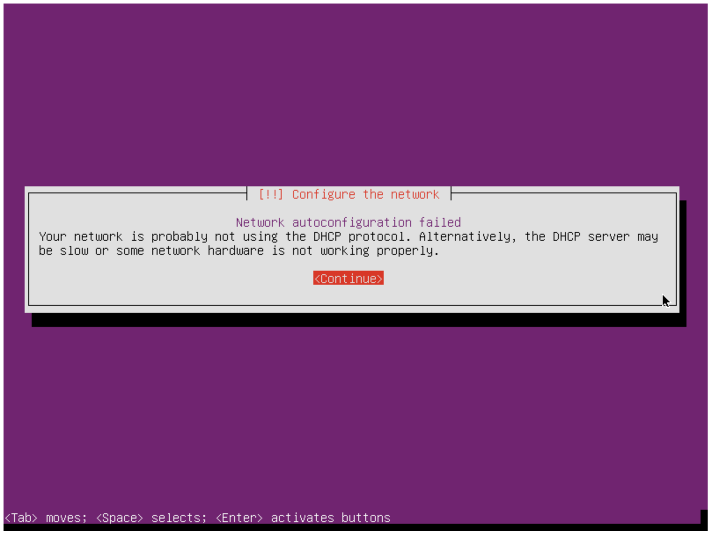
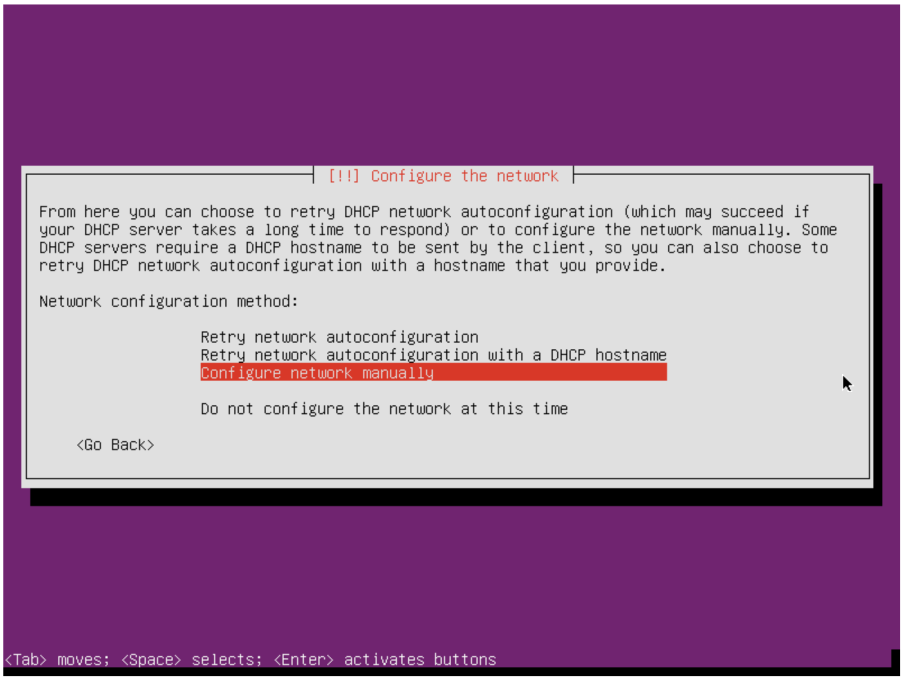
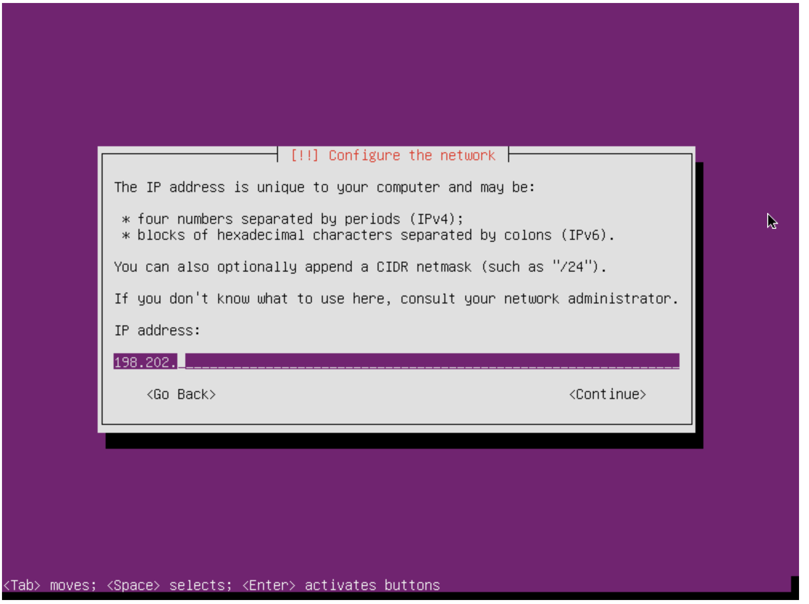
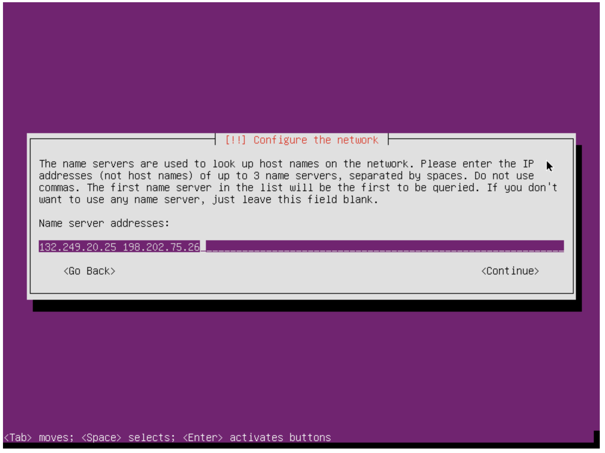
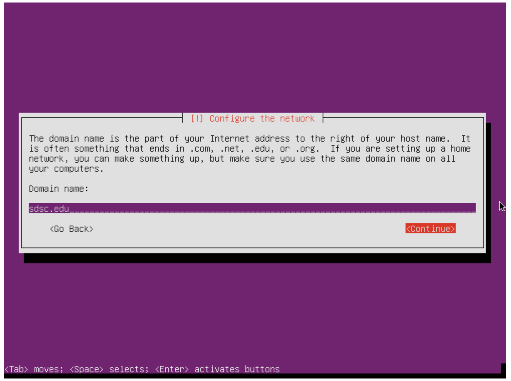

Comet Cloudmesh Tutorial
=========================

SetupCloudmesh Client on Ubuntu Desktop in Virtualbox

Virtual Box
----------------------------------------------------------------------

* For convenience we will be using Ubuntu Xenial in this demo to install
the cloudmesh client on it 

* Please make sure you have virtualbox installed

* The link to the download is https://www.virtualbox.org/wiki/Downloads

* Download ubuntu desktop
http://www.ubuntu.com/download

* Remember the location

* Start virtualbox, create e new VM (Ubuntu, 64bit)
* Start the box
* When asked for the iso, use the folder icon to browse to the location of the downloaded image.
* Start and configure the image
* Start a terminal 
* You may want to enable past and copy between host and vm and add the guest additions.
  
.. prompt:: bash

    wget -O cm-setup.sh http://bit.ly/cloudmesh-client-xenial
    sh cm-setup.sh

What is in the script:
    
.. prompt:: bash

    sudo apt install python-pip -y
    sudo apt install libssl-dev -y
    sudo pip install pip -U
    sudo apt install git -y
    sudo pip install ansible
    sudo pip install cloudmesh_client
    python --version
    pip --version
    git –version

Configure Cloudmesh
-------------------

.. prompt:: bash

   ssh-keygen
   cm
   cm version

    
Instalation with Pip
----------------------------------------------------------------------

Installing in a virtualenv is recommended.

.. prompt:: bash

  pip install cloudmesh_client
  cm help
  cm comet init

Getting access to your cluster
----------------------------------------------------------------------

Access your vc

Cluster info:

.. prompt:: bash

  cm comet cluster ll 
  cm comet cluster
  cm comet cluster vc2

ISO images:

.. prompt:: bash

  cm comet iso list
  cm comet iso attach ubuntu-14.04.4-server-amd64.iso vc2

Example: Install the front-end node
----------------------------------------------------------------------

Find an iso and attach

.. prompt:: bash

  cm comet iso list
  cm comet iso attach ubuntu-14.04.4-server-amd64.iso vc2

Getting network configuration parameters

.. prompt:: bash

  cm comet node info vc2

Power on the node

.. prompt:: bash

  cm comet power on vc2

If it is already running, please power if off so the iso attach could take effect:

.. prompt:: bash
  
  cm comet power off vc2

Attach console to finish the OS setup

.. prompt:: bash

  cm comet console vc2

Screenshots for the frontend node configuration:

.. figure:: ./images/00_install_start.png
   :scale: 50 %
   :alt: screenshot

   Figure: Install ubuntu server

.. figure:: ./images/01_NIC.png
   :scale: 50 %
   :alt: screenshot

   Figure: Configure the network

   Figure: Configure the network/dhcp (let it fail)

   Figure: Configure the network manually

   Figure: Add your public ip adress, note yours may be different

.. figure:: ./images/05_net_mask.png
   :scale: 50 %
   :alt: screenshot

   Figure: Add your netmask, note yours may be different

.. figure:: ./images/06_net_gateway.png
   :scale: 50 %
   :alt: screenshot

   Figure: Add your gateway, note yours may be different

   Figure: Add your DNS servers, note yours may be different

.. figure:: ./images/20_hostname.png
   :scale: 50 %
   :alt: screenshot

   Figure: Set the hostname (to be your VC name preferably)

   Figure: Set the domain name

.. figure:: ./images/08_partition.png
   :scale: 50 %
   :alt: screenshot

   Figure: Partition the disk
   
.. figure:: ./images/22_user_password_creation.png
   :scale: 50 %
   :alt: screenshot

   Figure: Set up the username/password. Remember this to login to the front-end node later.

.. figure:: ./images/09_services_packages.png
   :scale: 50 %
   :alt: screenshot

   Figure: Select default services you like. 'OpenSSH server' is required.

Finishing Front-end setup
----------------------------------------------------------------------
At end of the installation, click 'complete' to finish the setup. The node will
reboot into the OS installation CD again, but now choose 'boot from first hard disk'
option from the booting menu. This ensure the node boots into the newly installed OS,
while having the OS installation CD still attached (we will need the CD again in the
later steps).

.. figure:: ./images/10_complete.png
   :scale: 50 %
   :alt: screenshot

   Figure: Complete the installation

.. figure:: ./images/11_complete_console_expired.png
   :scale: 50 %
   :alt: screenshot

   Figure: The node will be rebooted and the console is now expired

.. figure:: ./images/12_reboot_cd.png
   :scale: 50 %
   :alt: screenshot

   Figure: Reboot the machine

.. figure:: ./images/13_reboot_cd_choose_hd.png
   :scale: 50 %
   :alt: screenshot

   Figure: Chose to boot from hard disk

Once the node is back on, you can now login and configure the cluster

via console:

.. prompt:: bash

  cm comet console vc2

via ssh:

.. prompt:: bash

  ssh USER@IP

Configuring the front-end node
----------------------------------------------------------------------

On your managing machine where cloudmesh client tools is installed:

.. prompt:: bash

  wget https://raw.githubusercontent.com/sdsc/comet-vc-tutorial/master/cmutil.py
  python cmutil.py nodesfile
  scp vcnodes_<VCNAME>.txt vcnet_<VCNAME>.txt <USER>@<VCIP>:~/

On vc front-end node:

.. prompt:: bash

  sudo su –
  cp ~<USER>/*.txt .
  wget https://raw.githubusercontent.com/sdsc/comet-vc-tutorial/master/deploy.sh
  wget https://raw.githubusercontent.com/sdsc/comet-vc-tutorial/master/cmutil.py
  sudo sh deploy.sh

Example: Install Compute Nodes
----------------------------------------------------------------------

Compute node setup

.. prompt:: bash

   cm comet start vc2 vm-vc2-[1-2]

Took about 15~20 minutes

Once done, the node will be shutoff

Changing to localboot. Do this on the front-end node:

.. prompt:: bash

  ./cmutil.py setboot $HOSTNAME <NODE> net=false

.. prompt:: bash

Then on your managing host where cloudmesh client is installed:

.. prompt:: bash

  cm comet power on vc2 vm-vc2-[1-2]

On front-end node:

.. prompt:: bash

  wget https://raw.githubusercontent.com/sdsc/comet-vc-tutorial/master/key_setup.sh
  sh key_setup.sh
  
This would setup the key, authorized keys, and known hosts files on the nodes.

login to compute nodes from front-end, and run your app.

