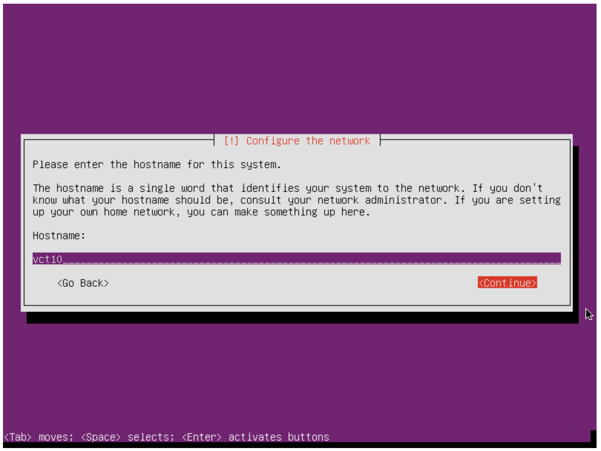
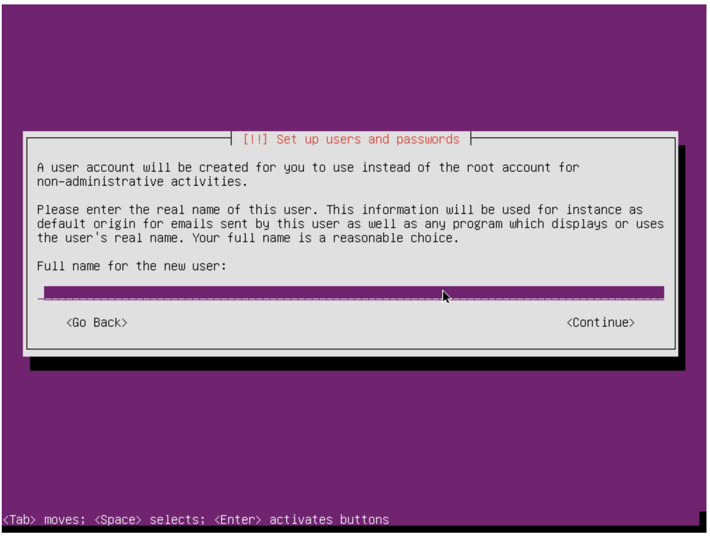
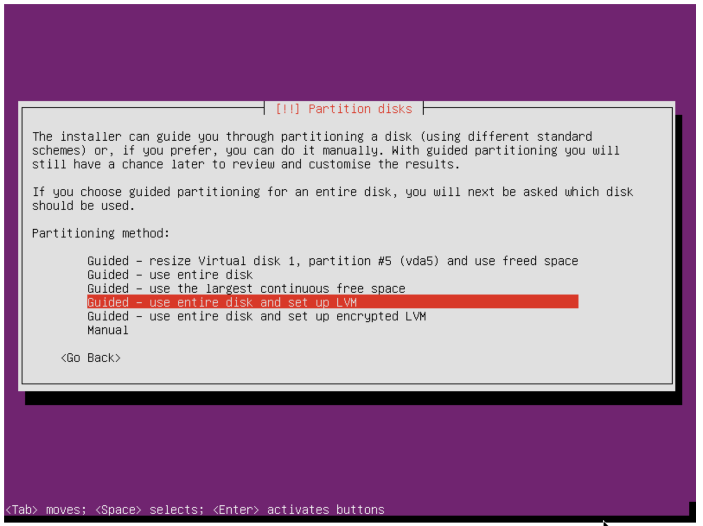
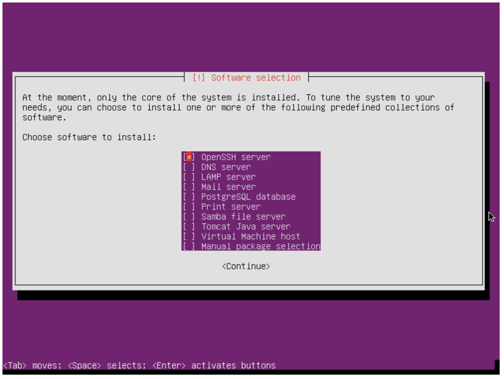
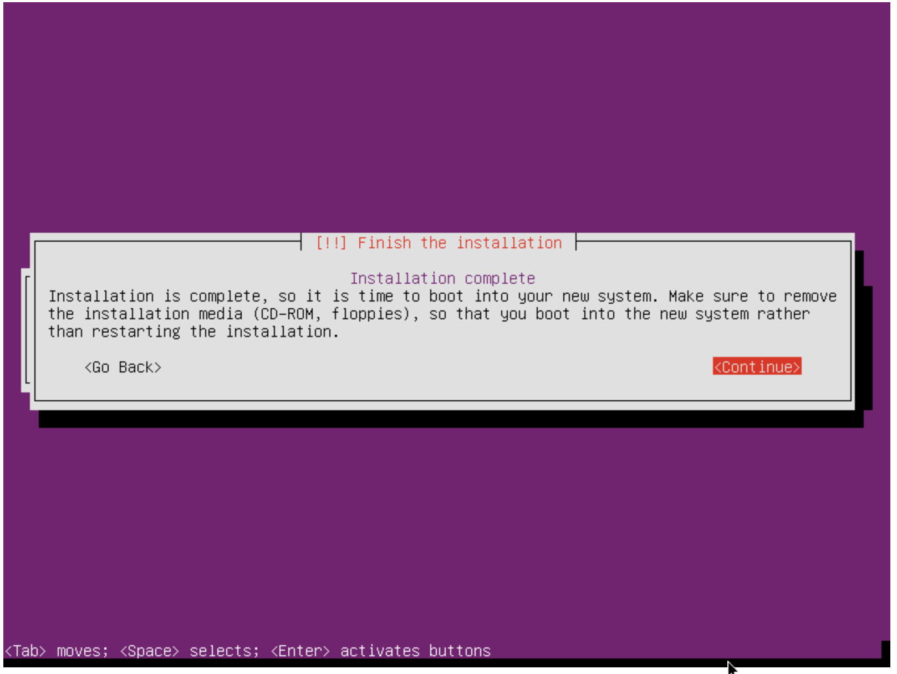
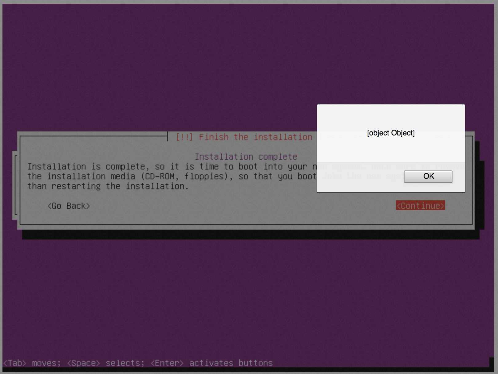
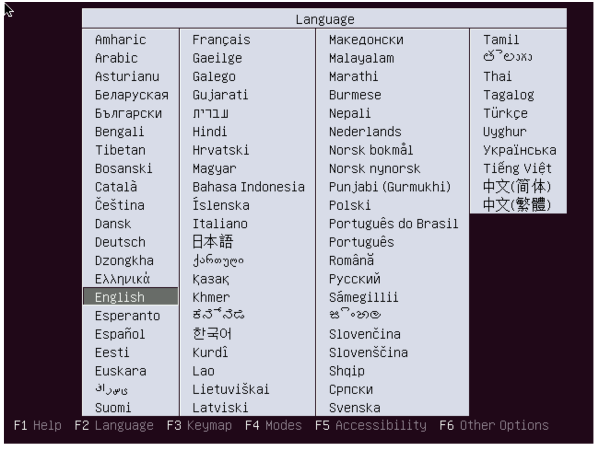
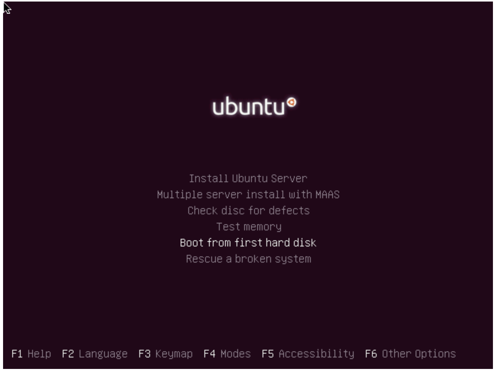

Comet Cloudmesh Tutorial
=========================

Setup Cloudmesh Client on Ubuntu Desktop in Virtualbox

Virtual Box
----------------------------------------------------------------------

**Step 1:** For convenience we will be using Ubuntu Xenial in this demo to
install the Cloudmesh client on it. Please make sure you have

* `VirtualBox <https://www.virtualbox.org>`_ installed (`downloads page <https://www.virtualbox.org/wiki/Downloads>`_).

**Step 2:** Next, please download the

* `Ubuntu desktop ISO <http://www.ubuntu.com/download>`_.

and remember the location where you downloaded it. You will need that location later.

**Step 3:** Create VirtualBox, create a new VM (Ubuntu, 64bit)

**Step 4:** Start the box. When asked for the ISO, use the folder icon to browse to the location of the downloaded image.

**Step 5:** Start and configure the system. Note in case the last step does not return, shut down or terminate the VM and restart it.

**Step 6:** Once you have logged into the vm, start a terminal by clicking on the cog and type in *terminal*

**Step 7:** (optional) You may want to enable the vm guest addition and enable bidirectional shared clipboard and drag and drop. You may have
to restart the vm so that these changes take effect.

**Step 8:** Install cloudmesh. Paste and copy between host and vm, as well as .

.. note: as well as . is unclear .... FIX
  
.. prompt:: bash

    wget -O cm-setup.sh http://bit.ly/cloudmesh-client-xenial
    sh cm-setup.sh

The script has the following contents:

.. prompt:: bash

    sudo apt install python-pip -y
    sudo apt install libssl-dev -y
    sudo pip install pip -U
    sudo apt install git -y
    sudo pip install ansible
    sudo pip install cloudmesh_client
    python --version
    pip --version
    git –version

Configure Cloudmesh
-------------------

Next, we need to configure cloudmesh. We will only use a fraction of cloudmesh
capabilities for this tutorial that is focused on using comet

.. prompt:: bash

   ssh-keygen
   cm
   cm version

    
Instalation with Pip
----------------------------------------------------------------------

Installing in a virtualenv is highly recommended.

.. prompt:: bash

  pip install cloudmesh_client
  cm help
  cm comet init

Getting access to your cluster
----------------------------------------------------------------------

Access your virtual cluster (vc)

The cluster information can be obtained with the following commands:

.. prompt:: bash

  cm comet cluster ll 
  cm comet cluster
  cm comet cluster vc2

The list of ISO images that are currently available can be obtained with:

.. prompt:: bash

  cm comet iso list

.. note: in future versions the command iso may be renamed to *image*.

Example: Install the front-end node
----------------------------------------------------------------------

Find an iso and attach

.. prompt:: bash

  cm comet iso list

This will return::

   1: CentOS-7-x86_64-NetInstall-1511.iso
   2: CentOS-6.8-x86_64-netinstall.iso
   3: kernel-6.2-0.x86_64.disk1.iso
   4: systemrescuecd-x86-4.2.0.iso
   5: base+kernel+kvm+os-6.2.x86_64.disk1.iso
   6: ubuntu-14.04.4-server-amd64.iso
   7: ubuntu-15.04-server-amd64.iso
   8: CentOS-6.8-x86_64-LiveDVD.iso
   9: ubuntu-16.04-server-amd64.iso
  10: CentOS-7-x86_64-LiveGNOME-1511.iso

Next we attach an iso. YOu can use either the name of the iso, or simply the id

.. prompt:: bash

  cm comet iso attach 6 vc2

Let us check the status of the server.

.. prompt:: bash

   cm comet cluster vc2

If it is already running, please power if off so the iso attach could take effect:

.. prompt:: bash

  cm comet power off vc2

Now we need to power on the server

.. prompt:: bash

  cm comet power on vc2

To see what is happening on the server, we can attach a console to follow and complete the setup of the OS

.. prompt:: bash

  cm comet console vc2

Screenshots for the frontend node configuration are given next:

.. figure:: ./images/00_install_start.png
   :scale: 50 %
   :alt: screenshot

   Figure: Install ubuntu server

.. figure:: ./images/01_NIC.png
   :scale: 50 %
   :alt: screenshot

   Figure: Configure the network. DHCP is configured on `eth1` (the public interface)

   Figure: Set the hostname

   Figure: Set up the non-privileged user account, including a strong password

   Figure: Partition the disk

   Figure: Select OpenSSH using the space bar and then tab to Continue

   Figure: Complete the installation

   Figure: Press CONTINUE (we'll detach the ISO later)

   Figure: The machine will be rebooted. Allow it to start booting from the CDROM again.

   Figure: From the CDROM boot menu, choose to boot from hard disk

Finishing Front-end setup
----------------------------------------------------------------------

At end of the installation, click **complete** to finish the setup. The node will
reboot into the OS installation CD again, but now choose 'boot from first hard disk'
option from the booting menu. This ensure the node boots into the newly installed OS,
while having the OS installation CD still attached (we will need the CD again in the
later steps).

Once the node is back on, you can now login and configure the cluster from your laptop/desktop:

.. prompt:: bash

  cm comet console vc2

YOu can also ssh into the machine after it is configures with the usual ssh commands while
using your login name that you set up and specify your cluster name.

.. prompt:: bash

  ssh USER@vct<NN>.sdsc.edu

Configuring the front-end node
----------------------------------------------------------------------

On your managing machine where Cloudmesh client tools is installed:

.. prompt:: bash

  wget -O cmutil.py http://bit.ly/vc-cmutil
  python cmutil.py nodesfile vct<NN>
  scp vcn*.txt <USER>@vct<NN>.sdsc.edu:~/

On vc front-end node:

.. prompt:: bash

  wget -O deploy.sh http://bit.ly/vc-deployment
  chmod +x deploy.sh
  sudo ./deploy.sh

Example: Install Compute Nodes
----------------------------------------------------------------------

Compute node setup

.. prompt:: bash

   cm comet start vc2 vm-vc2-[1-2]

Takes about 15~20 minutes. Once done, the node will be shutoff.

Once you see the boot question in your console log, please change it to
Changing to localboot. Do this on the front-end node:

.. prompt:: bash

  ./cmutil.py setboot $HOSTNAME <NODE> net=false

.. prompt:: bash

Then on your managing host where Cloudmesh client is installed:

.. prompt:: bash

  cm comet power on vc2 vm-vc2-[1-2]

On front-end node:

.. prompt:: bash

  cd $HOME/comet-vc-tutorial/
  ./key_setup.sh
  
This would setup the key, authorized keys, and known hosts files on the nodes.

Login to compute nodes from front-end, and run your app.

.. note:: In the production we use two factor authentication with yubikeys.
          To simplify the the tutorial we use username and  password access for the
          isolated teaching environment. When utilizing the production version you
          will need to get in contact with the comet staff. You must have a valid
          XSEDE allocation.